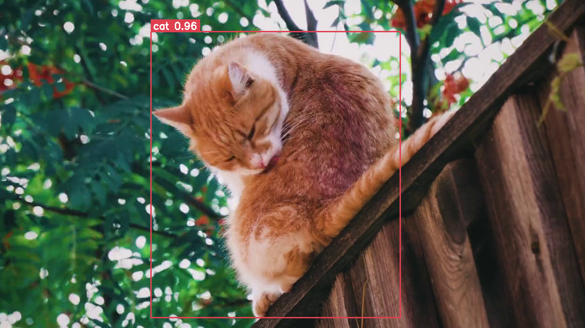

## Requirements
``` console
pip install ultralytics
pip install opencv-python
pip install typer
```
## Quick start
``` console
python object_detection_yolov8.py video <video_path.mp4>
python object_detection_yolov8.py video <video_path.mp4> --output-path <output_path.mp4>
python object_detection_yolov8.py webcam
```
## References
- https://www.computervision.zone/courses/object-detection-course/
- https://youtu.be/WgPbbWmnXJ8?feature=shared
## Courtesy
- https://pixabay.com/videos/cat-nature-animal-outdoors-pet-32033/
